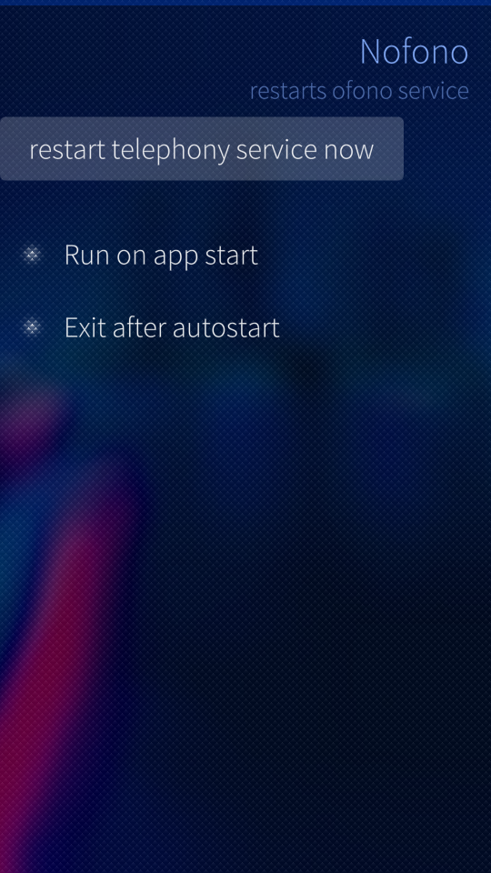
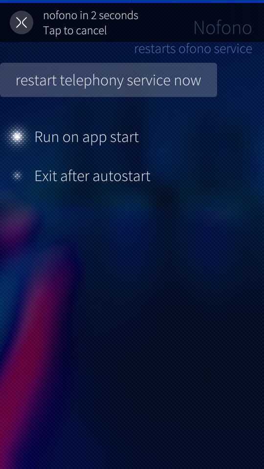

#   Nofono

[Nofono](https://github.com/jgibbon/nofono) is a graphical utility for SailfishOS to easily restart the ofono service via `systemctl restart ofono` without the need for a command prompt. Yes, that is everything it does.

## Warning
*It takes root privileges to restart ofono.*

## Why
When the ofono service hangs, having a quick way to restart ofono
without using a terminal or restarting the whole phone is really convenient sometimes.

This is what it may look like if ofono needs a restart:

Run Nofono – if you have enabled "auto run", ofono will be restarted
after a short time (to allow canceling). Optionally, Nofono will then terminate when it's done.

Alternatively, you can tap a button to restart ofono.

## Download
App can be downloaded from [openrepos.net](https://openrepos.net/content/velox/nofono)

## Acknowledgement
The development of Nofono relied *heavily* on code taken from
[Sailcron](https://github.com/a-dekker/sailcron). Thanks!

## Screenshots
Hardly anything to see, but this is it:

